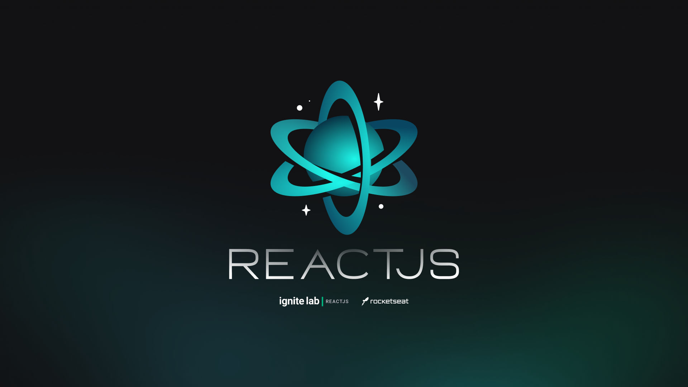
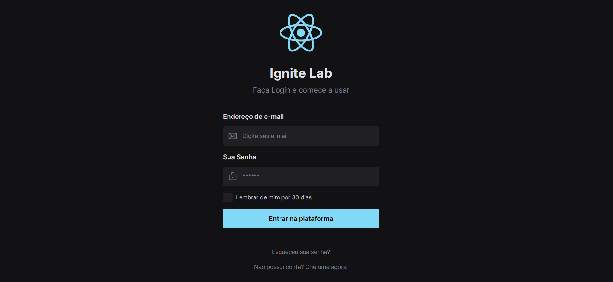

<p align="center">
  
</p>

<p align="center">
  <a href="#-tecnology">Tecnology</a>&nbsp;&nbsp;&nbsp;|&nbsp;&nbsp;&nbsp;
  <a href="#-project">Project</a>&nbsp;&nbsp;&nbsp;|&nbsp;&nbsp;&nbsp;
  <a href="#-license">License</a>
</p>

<p align="center">
 

  
</p>

<br>

## 💻 Project

##### Projeto Front-End, Construido durante o Ignite lab

<p>projeto desenvolvido no ignite lab 03, onde foi desenvolvido uma aplicação do figma ao react aprendendo varias funcionalidades de desing system e storybook</P>


# Preview 🛰

<p align="center">
  
</p>

# 🌐 Link 

<p>link da documentação criada no storybook:</P>
https://edsnasc.github.io/Lab-ds/
<br>
<br>

## 🚀 Technology

This project was developed with the following technologies:

<b>Frontend</b>
- [React]()
- [storybook]()
- [tailwind css]()
- [Radix-UI]()


## 🛠 Install

1. Clone o repositório:

   ```bash
   $ git clone https://github.com/edsnasc/Lab-ds.git
   ```
2. execute os comandos 

    ```bash
    $npm install - instale as dependencias
    $npm run dev - execute o web
   ```
---

Created by Edson Nascimento 🚀/ [LinkedIn](https://www.linkedin.com/in/edson-nascimento-5783681aa/)
